# AI Design: SOLID Principles (ML-focused)

This repository demonstrates how to structure ML code using SOLID principles, starting with SRP (Single Responsibility Principle). Each example contrasts a “violation” (god class) with a “solution” (small, focused components) on the same task.

- Start with SRP: `solid/SRP/`
- Design patterns live in separate repositories; see `design-patterns/INDEX.md`.

## Repository architecture



### What you’ll find
- Violation (SRP): a single class loads data, builds the model, trains, evaluates, logs, and saves — showing why it’s rigid and hard to test.
- Solution (SRP): responsibilities split into small services (data loader, trainer, evaluator, tracker, repository) orchestrated by a thin pipeline.

### Why this matters
- SRP improves cohesion and testability: each module has one reason to change.
- Changes become localized (e.g., change storage without touching training).
- The pipeline coordinates steps but contains no heavy logic.

## Quick start

From the repository root, you can run either the violation or the solution. See `solid/SRP/docs/01-quickstart.md` for OS-specific commands and details.

### Violation
1. Create environment and install deps
   - `python -m pip install -r solid/SRP/violation/requirements.txt`
2. Run
   - `python -m solid.SRP.violation.run_training --config solid/SRP/shared/fixtures/model_config.yaml`

### Solution
1. Create environment and install deps
   - `python -m pip install -r solid/SRP/solution/requirements.txt`
2. Run
   - `python -m solid.SRP.solution.run_training --config solid/SRP/shared/fixtures/model_config.yaml`

Notes
- Config precedence: CLI > YAML > defaults.
- The dataset is shared: `solid/SRP/shared/fixtures/sample_data.csv`.
- For very small CSVs, the split may fall back to non-stratified; use `--no_stratify` to force it.

## Project structure (SRP module)

```
solid/SRP/
  shared/fixtures/           # common dataset and config
  violation/                 # god-class example (anti-pattern)
  solution/                  # SRP-applied components (data, training, eval, tracking, storage)
```

## How SRP is applied
- Data loader: reads CSV and returns tensors; handles stratify fallback.
- Trainer: owns the training loop; no logging/persistence logic.
- Evaluator: computes metrics; no training/data logic.
- Tracker: records params/metrics; no training logic.
- Repository: saves/loads artifacts; no training/metrics logic.
- Pipeline: orchestrates the above; no heavy business logic.

## Conda setup (optional)

1) Install Miniconda
- Download Miniconda (Python 3.x) for your OS: https://docs.conda.io/en/latest/miniconda.html
- Run the installer with defaults, then open a new terminal.

2) Create and activate an environment
```bash
conda create -n srp-ml python=3.10 -y
conda activate srp-ml
```

3) Install dependencies for a module (example: SRP violation)
```bash
pip install -r solid/SRP/violation/requirements.txt
```

On Windows PowerShell, use the same commands after installing Miniconda.


